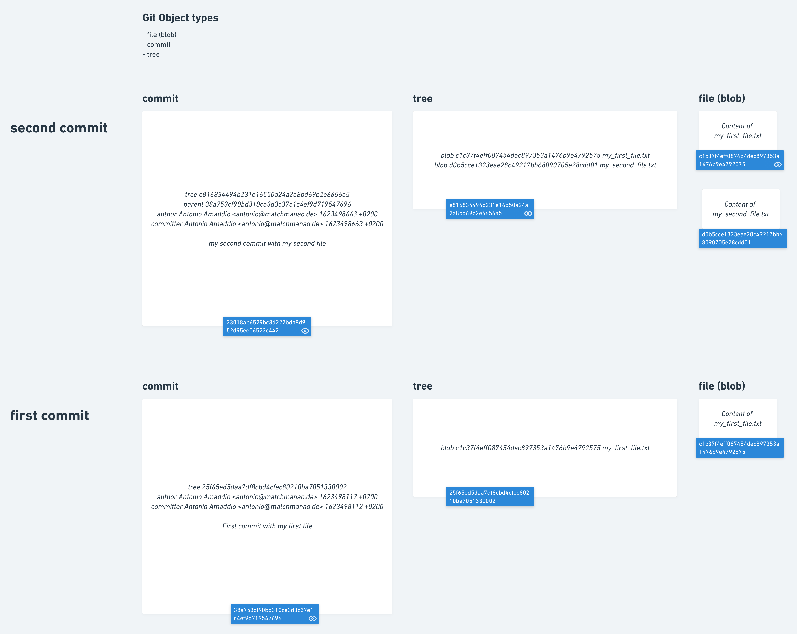

# Git workshop


## Day 1: session 1

__TOC__

Summary of first session:

 - Git Background
 - Git configuration
 - Advantages of Git explained in John's story
 - Initialize Git repository
 - Ignoring files
 - File tracking
 - Git internals

## Prerequesits of Workshop

- install `git`
  - Fedora, RHEL or CentOS: ` sudo dnf install git-all`
  - Debian: `sudo apt install git-all`
  - linux: https://git-scm.com/download/linux
  - Mac: Preinstalled. Check with:  `git --version`
  - if not install lates binary here: https://git-scm.com/download/mac
  - windows: https://git-scm.com/download/win

- install `sourcetree`

## Naming

Torvalds sarcastically quipped about the name git (which means "unpleasant person" in British English slang):
> "I'm an egotistical bastard, and I name all my projects after myself. First 'Linux', now 'git'."[23][24]

The man page describes Git as "the stupid content tracker".[25] The read-me file of the source code elaborates further:[26]
	
> "git" can mean anything, depending on your mood. random three-letter combination that is pronounceable, and not actually used by any common UNIX command. The fact that it is a mispronunciation of "get" may or may not be relevant.
stupid. contemptible and despicable. simple. Take your pick from the dictionary of slang.
"global information tracker": you're in a good mood, and it actually works for you. Angels sing, and a light suddenly fills the room.
"goddamn idiotic truckload of sh*t": when it breaks  


## What is Git in one sentence?

> Def: "distributed revision control system"

## Basic Configuration (Page 21)

- `git config --global user.name "My User Name"`
- `git config --global user.email "my_email@address.com"`
- `git config --global color.ui true`
- `git config --global core.editor vim`
- `git config --global alias.lol "log --oneline --graph --decorate"`
- `git config --global alias.lola "log --oneline --graph --decorate --all"`

If you work on your branches on your own:

- `git config --global pull.rebase "true"` (_explained later_)

Levels (and locations) of git configurations in ascending prioritized order:
- System (all users) config file: `/etc/gitconfig`  
- Global config file: `~/.gitconfig` (or `~/.config/git/config`)
- Working directories config file:`.git/config`

##  Advantages of Git (John's story)

# todo: Create memes in Adobe Spark with pictures John's peoplethatdontexist.com

John has started his journey as a PHD student.
Eagerly and overly optimistic he created a draft of his doctoral thesis
on day one. As days go by he writes and rewrites parts of his thesis.
He stumbles over a good read and over enthusiastically decides to delete
some earlier paragraphs because the reported evidence has proven his hypothesis
of his theory wrong. A week later he finds the final paper of the draft that
he has been studying. In this version the authors say that they have made a
mistake in their analysis and that the result are in line with current research.

Frightened to loose his past document state he opens his file trys the "back" buttons
400x just to figure out that he can't go back. He cries!

➡️&nbsp; Git `#history`: Git stores every version of any file that you want it to.
Basically it is a database of your versioned documents.

As John has learned the hard way he is making backups on a daily basis. He is
so disciplinated. Look. His current working draft carries the name:

- thesis-day-43-good-version-typos-removed.text

The ones before were:

- thesis-day-39-methods-complete.text
- thesis-day-40-tired--no-good-version.text
- thesis-day-40-fixing-stuff-for-review.text
- thesis-day-40-stuff-fixed.text
- thesis-day-40-stuff-fixed-final.text
- thesis-day-40-stuff-fixed-final2.text
- thesis-day-40-stuff-fixed-final3.text
- thesis-day-40-stuff-fixed-final-really-final.text
- thesis-day-40-stuff-fixed-final-really-final-version2.text
- thesis-day-41-reasonably-good-version-needs-review.text
- thesis-day-42-reviewer-is-stupid-need-new-reviewer.text
- thesis-day-42a-reasonably-good-version-after-review.text

...

➡️&nbsp; Git `#version`: Document each version with a comprehensive comment and store each set of changes in a reusable manner.

> John is going on his first conference to Tel aviv.
His overly funny smile and his notebook with 51 colorful stickers on them raises the attention of the customs.
They say they want to check on his computer.
They say it'll take days.
John is upset because all his work is stored on the computer
and he can not continue with his project.

> He goes to the city checks into a hostel. As the fourth beer keeps flushing down the throat an idea comes to his
mind. Why not work online and use a fancy cloud service. That way he can access his document's from any computer!
Isn't this great? Excited he pays a few Shekel and starts to fire up a dodgy computer in the hostel lobby
and writes down his new thoughts of his future research. Google Docs is a bliss he thinks. 5 hours later, 6 bottles of
Club Mate and 20 shekels lighter he goes to bed tired.

> Early the next morning he get's a call from customs that his computer seems to be fine besides the amount of
funny cat videos und nerdy memes about science that literally no normal person understands.

> He get's to the airport customs and flies back home. His notebook on his lap. Happy and ready to continue with his work.
> He unfolds his notebook and trys to load the Google Doc file. No internet connection it sais. Crap!

➡️&nbsp; Git `#decentralisation`: Work offline; Work on different machines. Best from both worlds.

> After John landed and arrived home he starts working immediately. He touches base with other pre-docs he connected with
on the conference. He wants to collaborate with a Sara who shares similar research questions.

> Sara sais she prefers to write heir articles in Latex. John can't be bothered to learn Latex and figures it's best to
exchange diffs with Sara whenever something changes.

> They keep sending each other different versions where one gets a time window of a week to add changes. As their document
keeps growing and growing John spends half of his work day integrating Sara's updates into his thesis. He stares at the
ceiling and wonders if there is no easier way to collaborate.


➡️&nbsp; Git `#branching`, `#merging`, `#patching (commit chunks)` `#stashing`: Git supports concurrent versions of files that you can branch and merge at any time you want. You don't have to
store files entirely. You can decide which chunks (lines) of a file you want to store (commit).

> John is proud to share his first set of data from his pilot with Sara. He zips his working directory and mails it to Sara.
After not hearing back for a weak he double checked his mail and the attachment he has sent.

> He realizes that he accidentially sent party pictures of his last trip to Mallorca. He now is worried that Sara
thinks that he is a douch and thinks about discontinuing to work together.


➡️&nbsp; Git `#data control`: You can review each commit before any push event and also prevent certain files to be committed. 

> Sara responds after a while saying that she's spend some time off and that she liked the party animal in John. Relieved
he zips his updated set of data and shares it with Sara. Sarah responds with a thank you and that the she loves the idea
of a shared GitHub account. Stumbled John thinks how Sara gained access to his hidden password file and realizes that
he did not remove the sensitive file before zipping.


➡️&nbsp; Git `#rewrite history`, `#documentation`: You can have full control over Git's stored history. That means you can rewrite (delete) parts of the history. Deletions
can also be publicy committed to document a roll-back of an error that one has made.

> John is a supporter of the open science idea. One day as John elaborates on the reproduction crisis and possible solutions. He wonders how he could share experimental code to collect data in different laboratories.
Engage others to challenge his findings by rerunning his experiments. Others would not need to write another instrument. The would simply rerun the same code.
In the same sense how he could reproduce findings by running existing experiments of others. Potentially much noise in the data could be prevented – at least distortions attributed to a different experimental code or misinterpred paradigms.
What a wonderful world this could be.

➡️&nbsp; Git `#collaboration` `#integration`: With git you can host your experimental assets (article, data analysis etc.) publicly.
Git has become such widespread cross different disciplines that one benefits from heaps of (software) integrations. Examples: [Open Science Framework](https://osf.io), [GitHub](https://github.com), [GitLab](https://gitlab.com), [RStudio](https://support.rstudio.com/hc/en-us/articles/200532077-Version-Control-with-Git-and-SVN), [Visual Studio Code](https://code.visualstudio.com/download)
You can provide versions of your experiment, document required changes, publish errors, interact with other researchers, generate static Digital Object Identifiers and link to them from your articles.

## Initialize Git repository

To start versioning files in a directory type:

```bash
 git init
```

It will create the hidden `.git` folder in your working directory.

To see the status of your files type:


```bash
git status
```

Sourcetree: File | New | Create local repository

## Ignore Files from Git (Page 33)

Ignore files by adding the file or directory name to a local file named `.gitignore`. These rules account for the entire repo including collaborateurs.
use localignore if the rules shall only apply to your system.

- shared ignore rules: `.gitignore`
- non shared ignore rules: `.git/info/exclude`

Syntax remains same for both files. Examples:

- ignore all .pdf files: `*.pdf`
- ignore files from a folder named `data`: `data/`
- ignore files from the folder named `data` of the current directory: `/data`
- ignore files from the folder named `data` in the `test` subdirectory: `/test/data`

### Group Task (ignore files)

Your experiment stores participants data in the folder ./data-collection/. Prevent git from adding any new untracked files.

You store some test files that others will not. Set up your local environment to not track these files. Keep the remote
repository untouched from this setting.

## Git storage (P. 17)

Overview which git commands effect which git storage(s): https://ndpsoftware.com/git-cheatsheet.html

- stash: stack of (temporarily) stored working states
- __working directory: The working state of your files__
- staging area (index): A version that you added to the index
- (local) repository: versions that you have committed to the repository
- (remote clones): upstream repository where your committs are pushed to and pulled from by collaborators

### Group Task (Git Storage)

Which storages are relevant for the following tasks:

- You create a local file on your computer.
- You change a local file on your computer.
- You delete a local file on your computer.
- You download (clone) a remote git repository. _(look at the cheat sheet)_
- You store your temporary changes of tracked files away into your stash. _(look at the cheat sheet)_

## Git file tracking

- What is a tracked file? When is a file tracked and when not?

A file is tracked once it has been added to the index. "Tracked" means that if a file changes (or is deleted) it is tracked by Git.

- To add a file (folder) to the index – _To stage a file_ – type: `git add <filename>`.
  - Sourcetree: Check files in list of unstaged files
- Remove file from index (keep in working directory): `git rm --cached <filename>`
- (old) Remove commited file from index (keep in working directory): `git restore --stage <filename>`
- (new >= 2.23.0) Remove commited file from index (keep in working directory): `git reset HEAD <filename>`
- To check out (!overwrite) a file from the index to your workspace version type: `git checkout <filename>`
  - Sourcetree: Select file | Click on bullets | Discard file

Once your file is tracked you can compare the files in your working directory and the staged version: `git diff`. Staged files can be compared to the repository version with `git diff --staged`

Basic file operations like deletion / renaming (moving).

- Delete a single file: `git rm <file_name>`
  - Delete file in Git keep in working directory: `git rm --cached README`
  - Remove all log files: git rm log/\*.log
- git mv
  - $ git mv file_from file_to

Note that you don't need to use these Git commands. Git will track these changes even when you
don't use the dedicated commands.

### Group Task (File Tracking)

- Initialize a Git repo.
- Add a file to the index.
- Add a second file to the index.
- Remove the second file from the index. Keep the version locally.
- Update your already staged file in the index.
 - List changes with `git diff` before you changes of the file to the index.
- Make some bogus changes to a file and restore it's state.

### Git storage (s. 17)

- stash: stack of stored working states
- __working directory: The working state of your files__
- __staging area (index): A version that you added to the index__
- (local) repository: versions that you have committed to the repository
- (remote clones): upstream repository where your committs are pushed to and pulled from by collaborators

## Partial File Staging

Why staging? Decide which changes (hunks) in a file should be staged `git add -p` to the index and which not.
Last minute decisions on what should be committed.

For untracked files: `git add -N <filename> & git add -p`

Carefull! Do not use Sourcetree for this operation. It changes your working copy version! You'll loose your changes.

### Group Task (Partial File Staging)

- Create two files with a few text lines in them.
- Add the first file entirely to the index.
- Partially add the second file to the index.

## Day 1: Session 2

## Commit (File Version Snapshot)

- version: full snapshot of file(s)
- locally: created fully locally
- integrity (sha checked)
- move reference (pointer)

To commit (store) staged files type: `git commit -m "<your message>"` or `git commit` and press enter.
What data is stored in a commit? (P. 66) 

- See the log of past commits: `git log`

Change a commit (that has not yet been pushed).

`git commit --amend`

If you are working alone in your branches you can also make use of interactive rebasing to edit any commit in the timeline: `git rebase -i`

**Deep dive into Gits databas**e:

- get all git objects: `find .git/objects -type f`
- get sha of git object of filename: `git hash-object <filename>`
- (-p: pretty) print content of git object `git cat-file -p <hash>`
- (-t: type) print type of git object `git cat-file -t <hash>`
- print content of master branch (tree): `git cat-file -p master^{tree}` (Page 436)

**Visualization**:

_Git objects that are created when you commit (snapshot) a new version of your files._

What means:
> `c1c37f4eff087454dec897353a1476b9e4792575` ?

SHA-1 hash. This is a 40-character string composed of hexadecimal characters (0–9 and a–f) and calculated based on the contents of a file or directory structure in Git

### Revert a Commit

To create a new commit that reverts an earlier one type: `git revert <commit>`. It applies the exact opposite of the reverted commit as new commit.

#### Group Task (revert commit)

- create a four commits
- revert the last

### Git Storage (Page 17)

- stash: stack of stored working states
- __working directory: The working state of your files__
- __staging area (index): A version that you added to the index__
- __(local) repository: versions that you have committed to the repository__
- (remote clones): upstream repository where your committs are pushed to and pulled from by collaborators  

➡️&nbsp; Git `#immutability`: instead of changing any data git creates a new history and moves a references

## Git reference (to a Commit) (P. 445)

A reference is a pointer to a commit in a branch. Whenever you create a new branch a reference will be created, which points
to the latest commit (of HEAD). To get all existing references to commits (`find .git/refs -type f`). 

- .git/refs/heads/master: reference to a commit
- .git/HEAD: reference to another reference (if not in detached HEAD state)
- tag: named reference to a commit
- refs/remotes: reference pointers when the last `git push` command were run e.g. `refs/remotes/origin/master`

### Self Recap and Challenge (home work) – Day 1

#### Recap
Read through John's story and assign the Git commands to each (all) principle(s). Example of the first principle: Which git commands
are required to master Git's `#history`. Note down and try out all commands that effect Git's history.

#### Challenge 1
You have been lazy and staged all files. The status shows a file that you do not want to commit. Reset the file from your index.

_(Page 39)_

#### Challenge 1

You have forgotten do add a file in your last commit. You have not yet pushed your last commit. Use this situation
and amend your last commit by adding the missed file and update the commit message.

_(Page 47)_

## Day 2: session 1

Working with remotes (Page 51). 

- Stashing
- Branch
- Rebase (97)
- Clone
- Fetch
- Merge
- Pull: git fetch and merge
- Push

## (temporary) Stashing of pending changes (Page 235)

Helpful command to temporary store changes in tracked files to continue later. Used in most cases when switching between branches.

`git stash` or `git stash push`

- list stored stashes: `git stash list`
- apply most recent stash: `git stash apply`
- apply and delete from stash list: `git stash pop`
- apply another stash: `git stash apply stash@{<numberofstash>}`
- delete a stash: `git stash drop stash@{<numberofstash>}`
- stash files and keep staged files untouched: `git stash --keep-index`
- stash files including untracked files: `git stash -u`

## Branch (Page 65)

Default branch name after `git init` is `master`. [_Main is the new master_](https://about.gitlab.com/blog/2021/03/10/new-git-default-branch-name/).
This main branch reflects the main line of your versions. If you think of your versions as of a tree then the trunk would be the main line of versions
branches would be experimental versions.


Recommendations:
- keep branches as little as possible (feature)
- do let branches diverge as little as possible (merge often)

What happens internally when you create a new branch:
  - creates reference named as the branch
  - updates HEAD (reference) to point to this reference
  - (!updates workspace files the state of the related commit – if states diverged)

_Note: any new commit will be added to the checked out branch – where HEAD is referencing to_

Show example in oh-my-git. Commands that will be used are:

- create a new branch and switch to it (check out): `git checkout -b <branch_name>`
  - alternative: `git switch -c new-branch`
- create a new branch: `git branch <branch_name>`
- switch to another branch: `git switch`
- delete a branch: `git branch -d <branch_name>`
   - force delete: `git branch -D <branch_name>`
- list branches: `git branch`
 - with last commit: `git branch -v`
 - only merged branches: `git branch --merged`
 - only not merged branches: `git branch --no-merged`

**Problem** with switching branches: clean working state. Switching branches requires a checkout which you can only do
when you all of your changes are committed. Solutions:
 - stash
 - temporary `commit` and `commit --amend` later

## Merging (one branch into another)

`git merge` merges one (time)line of commits into another. This way you can integrate someone elses or your own versions
into each other. Keywords that you might encounter are:

- fast forward (merge): when Git is able to move the branch (reference) up consequently due to only new commits
 - Git determines this by reachableness of the commits (a --> b --> c)
- regular (three-way) merge (Page 78):
 - 1: tip of branch a
 - 2: tip of branch b
 - 3: last common commit in timeline

- merge another branch into the current branch (HEAD): `git merge <branch_name>`

### Group Task (Branch and Merging)

**Scenario**: You are working on your experiment application as the lab manager calls you and tells you that there
is a bug in your code and you need to fix it before the next participant comes.

**Task**:

- create a `experiment` file in the `master` branch
- create a feature branch `increase_inter_trial_timespan`
- make some (planned) changes to the `experiment` file.

Now the lab manager comes in with his urgent matter:

- create a `laboratory_infinite_loop_bugfix` branch
- create a new `bugfix` file
- merge the `laboratory_infinite_loop_bugfix` branch into `master`
- (imagine you deploy the fix to the lab now)
- delete the bugfix branch

Continue with your planned work:

- switch to your feature branch
- add some changes to your experiment file and commit them
- merge your feature into the `master` branch

## Merge conflict (non Auto-Merge)

Git is not always able to automatically integrate changes between the three snapshots (three-way merge).
It occurs only in non fast forward merges when files have changed in both branches.
Reason: the next common parent commit does not share the same sha of the changed files.

The result is called a merge conflict. The merge is not committed but left in a broken state. The state contains the
auto-merged files by Git and the conflicted files that you have to merge manually.
To solve this:  

- List the conflicted files type `git status`,
- fix the conflicts in the files manually (remove  `<<<<<<<`, `=======`, and `>>>>>>>`),
- stage the fixed files (`git add <fixed filename>`)
- and finally run `git commit`.

The conflicted lines that Git were not able to merge look like this in the conlicted files mentioned by `git status`.

```
<<<<<<< HEAD:start.py
  
  def exp_function():
    print("Start of Exp")

  =======
  def experiment_function():
    print("Start of Experiment")

>>>>>>> other_branch_name:start.py

```

### group task (merge conflict)

You are an experienced Git gun and a friend asks you to to help him the fix the mess that occured after a merge conflict.
Try to fix the merge conflict. No more instructions given:

/Users/antonio/Documents/Gewerbe/MPIB/Git/examples/merge-conflict

## Git rebase (Page 97)

Git rebase helps to create a clean line of history without merge commits.

If you are working alonine in your local and remote branches:  
To switch the `git pull` strategy from `merge` to `rebase` adjust the config: `git config --global pull.rebase "true"`.
Default rebasing merge strategy is not recommended for collaborative working!

If you want to retrieve changes of the remote and wind your work on top of it: `git pull --autostash --rebase`

If you are working with other people on the same branches:
- do rebase locally
- do not rebase commits that you have already pushed
- prefer merge commits for already pushed commits

Optional: What's the problem when when you rebase a commit that someone has based work upon? See: Page 100

### Cherry Picking (Page 163) – optional

Instead of rebasing commits of one branch on top of another you can reapply a single commit to another branch with `git cherry-pick <commit-sha>`

## Git log (Page 42)

With `git log` you can overlook the entire timeline of commits. In the log you'll find out:

- what has been changed,
- when,
- by whom,
- read the authors description of the set of changes.

List of useful git log formulas:
- list past commits ordered by most recent commits, current branch (HEAD): `git log`
- show changes in files between commits: `git log -p`
- show changes abbreviatedly in files between commits: `git log --stat`
- show last to commits only: `git log -2`
- show log as graph in one line of current branch: `git lol` (git config must be set)
- show log as graph in one line of all branches: `git lola` (git config must be set)
- show commits no older than one week `git log --since=1.weeks`
- git log --since="1 day"
- show commits that contain <search_string> in commit message: `git log --grep=<search_string>`
- show commits that added/removed <search_string> in files: `git log -S<search_string>`
- show all commits but merge-commits: `git log --no-merges`
- show all commits that are in branch A that are not in branch B: `git log <branch_a> ^<branch_b>`
 - show all commits in remote branch that are not yet in local branch: `git log origin/main ^main`

_Note that these arguments can be combined e.g. `git log -2 -p`_

You can customise log commands that are not predefined to float your boat: see Page 44.

## Day 2: session 2

## GitHub (Page 169)

Add GitHub Account to Sourcetree:

1. sourcetree | preferences 
2. Click Accounts (tab)
3. Click Add button 
4. Choose "Host": `GitHub`; "Auth Type": `OAuth`
5. Sign into GitHub in browser window


## Remote repository

Remote repositories are the same as your local repository – just hosted remotely. You can use a remote source
to collaborate with others or to use it as a back-up for yourself.

To connect your local (existing) repository to a (GitHub) remote:

- add a remote URL to your local repository `git remote add <shortname> <url>`
  - `git remote add origin git@github.com:<username>/<project_name>.git`
- (optional: if you choose to use `main` as the main branch name instead of master)
 - (move (rename) current (`master`) to `main` branch `git branch -M main`)
 - (push to and assign remote upstream branch for `main` local branch: `git push -u origin main`)
- push your changes to the remote: `git push -u origin master`

- list infos about remote: `git remote show origin`
- list (fetch, push) URLs of remote repository: `git remote -v`
- list infos (pull/push url, branches, etc.) about the remote: `git remote show <remote>`

To connect to an existing remote repository you need to use Git's `git clone` command.

- clone from remote: `git clone <remote_url>`
- view connected remote: `git remote -v`

## Fetch (Central to Local)

To retrieve all remote changes use the fetch command. Note that it fetches udpdates without touching your working directory.
If you want to update your working directory you have to use the `git merge` command manually. Instead you could use the
`git pull` command to do this in one go.

- fetch new changes `git fetch <remote>`
 - once defaults are assigned `git fetch`
- merge new changes into your local repository `git merge origin/master master`
- fetch and merge changes `git pull`
- show all commits of fetched branches that are missing in the local branch: `git log origin/main ^main`

#### Push (Local to Central)

To push your local git repository remotely you can use the `git push` comand. This command collects all changes
that exist locally and not yet in the remote source and uploads them. The command works as soon as you have
configured a remote source repository.

- `git push origin master`
 - once default branches are configured: `git push`
- show all local commits that are missing in the remote branch: `git log main ^origin/main`

### Open Science Framework (osf.io)

- 1. Create a new project
- 1. Add GitHub addon "Add-ons | Select Add-ons" Choose GitHub `https://osf.io/<project_short_url>/addons/`
- 1. Configure Add-ons by giving osf.io access to your GitHub account


## recommendations

## workflow

Recommended workflow prior changing files:

1. Fetch to see what's changed.
2. Check if the changes should be merged into your branch
3. Commit and share (push) your changes as soon as you have a working set.

### general
1. fetch, than merge manuall OVER pull
2. merge over rebase
3. do not have one repository for all your projects. One repo for one project.
4. use large file storage for > 100MB
5. make small commits
 - commit often: prevents you from loosing data e.g. `git reset --hard` or `git checkout <file name>`
6. Golden rule of rebasing

> "Do not rebase commits that exist outside your repository and that people may have based work on." (Page 102)

## Git links

### Git Bible
This book has been referenced in the workshop.  
https://git-scm.com/book

### official Documentation
https://git-scm.com/

### sourcetree Documentation
https://support.atlassian.com/sourcetree/

### cheat sheets
- https://training.github.com/
- overview which git command effects which storage: https://ndpsoftware.com/git-cheatsheet.html

#### cheat sheet

- short status: `git status -s`
- stage all files ending with .py `git add *.py`
- stage (patch) sections of files `git add -p`
- to stage untracked files partially use `git add -N <filename> & git add -p`
- difference between stage and working directory: `git diff`
- difference between stage and local repository: `git diff --staged` or `git diff --cached`
- git commit changed tracked files: `git commit -a -m '<commit message>'`
- remove file from index (but keep locally): `git rm --cached README`
- show missing (unreachable) commits that are found in branchA that are not in branchB: `git log branchA ^branchB`
- show missing (unreachable) commits in local repository (after fetching from remote): `git log origin/master ^master`

### deep dive into git internals
https://github.com/pluralsight/git-internals-pdf

### escape a git messs
Use this flow chart if you happen to have messed up your local repository completely.
http://justinhileman.info/article/git-pretty/git-pretty.png

### storage of git objects
https://www.youtube.com/watch?v=P6jD966jzlk

## References
- Pictures of John and Sara are from https://thispersondoesnotexist.com/